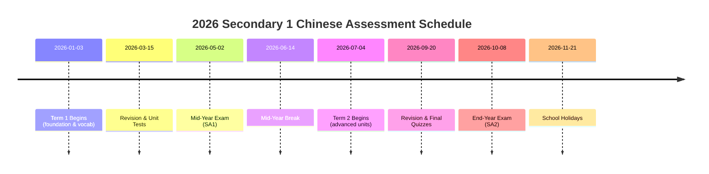

# Secondary 1 Express Chinese (MOE Express Stream) – Executive Summary

Secondary 1 Chinese in the Express stream (Singapore) builds on primary Chinese foundations to develop **confident, proficient language users** with strong listening, speaking, reading and writing skills【50†L79-L87】【26†L31-L39】.  The MOE curriculum’s broad objectives are *Communication, Culture, and Connection*: students learn to use Chinese accurately and meaningfully in real contexts while appreciating culture【50†L79-L87】.  By year-end, pupils are expected to understand age-appropriate spoken and written Chinese (stories, dialogues, news, ads, etc.), express ideas clearly in speech and writing, and interact effectively in Chinese【26†L35-L43】.  

The Sec 1 syllabus (aligned to MOE Syllabus 1160 for Express Chinese) covers themes like **family, friends, community, values and culture**【52†L180-L188】.  Official content (via approved textbooks) is organized into units on these themes, with concomitant vocabulary, grammar and character work.  Key grammar includes complex sentence patterns (e.g. 虽然…但是, 只要…就), connectors and proper sentence structure.  Students also learn formal forms (e.g. email conventions) and idiomatic expressions.  Character-writing continues from Primary, with emphasis on correct strokes and expanding vocabulary (including 成语 and proverb usage). 

**Assessment** in Sec 1 is school-based: typically two formal exams (SA1 mid-year and SA2 year-end) plus ongoing evaluations (oral tests, listening, weekly quizzes, compositions, etc.).  MOE advocates a balanced system of **Assessment for Learning (AfL)** and **Assessment of Learning (AoL)**【60†L60-L64】.  Schools commonly use *weighted assessments* (WAs) such as quizzes or oral tests (often 10–15% each) alongside end-of-term exams【60†L117-L122】.  (Exact weightings vary by school; e.g. some schools assign ~50% to written exams and ~50% to continuous assessment.)  There is no PSLE Chinese at Sec 1 – national exams only occur at Sec 4 O-Levels. 

**Sample lesson plan / scope:** A typical week might introduce new vocabulary and grammar (with a quiz), include a reading text or article (current-event news or textbook passage) for comprehension practice, involve guided writing or composition work, and feature speaking/listening drills.  For example, one lesson might begin with a vocab review quiz, then silent reading of a newspaper excerpt, followed by discussion questions and a short writing task (such as a journal entry)【62†L63-L72】.  Regular activities include alternating composition and comprehension practice, topical discussions (e.g. interpreting a news story), and intensive language drills (vocab & idioms)【62†L63-L72】. 

**Resources:**  Schools generally use MOE-approved textbook series (e.g. *Chinese Language for Secondary Schools* 1A/1B by Marshall Cavendish, Shing Lee’s *Express Chinese*, etc.).  Popular supplements include vocabulary workbooks, composition guides, and past-year exam compilations.  Online resources (news portals, radio broadcasts) support current-affairs literacy.  Parents and tutors often recommend SEAB O-Level past papers and marking schemes (code 1160) for practice【69†L71-L76】.  (See table below for key resources.)

**Teaching strategies:**  Instruction is *explicit and differentiated*: teachers scaffold new skills, use multimedia and realia, and gradually shift responsibility to pupils【50†L105-L114】.  Cultural elements and values are infused into every unit【52†L180-L188】.  Lower-achieving students benefit from bilingual support and regular revision; stronger students can be challenged with extra reading (e.g. news articles or Higher Chinese passages).  Active learning (group discussion, presentations) and formative feedback are encouraged in line with MOE’s learner-centered approach【60†L73-L82】. 

Below is a detailed breakdown of syllabus content, outcomes, assessment, and other facets.

---

## Curriculum and Topics (Secondary 1 Express)

**Curriculum Framework:**  MOE’s Secondary Chinese curriculum is organized into thematic units (friendship, family, community, culture, etc.)【52†L186-L194】.  Within each unit, pupils learn new vocabulary, grammar structures, and literary passages. Cultural themes (traditional stories, festivals, values) are integrated to provide context【52†L186-L194】.  For example, a unit on “Community” might include a reading on Singapore festivals and related idioms.  

**Sample Units/Themes:**  (Themes are indicative; schools may use various titles.) 

- **School & Identity:** Daily school life, routines, friendships. 
- **Family & Relationships:** Family roles, generations, filial piety.  
- **Community & Society:** Festivals, community service, cultural celebrations.  
- **Media & Information:** Reading simple news stories, discussing current events.  
- **Environment & Values:** Local issues (cleanliness, respect), moral values.  

*Note:*  Textbook unit titles vary by publisher.  MOE states units are built around relationships, family and community, with cultural and contemporary content woven in【52†L186-L194】. 

**Grammar & Language:**  Secondary 1 expands on Primary grammar.  Students encounter complex sentences (e.g. “虽然…但是…”, “只要…就…”, “不仅…而且…”), conditionals, passive voice usage, and more formal connectors.  They learn correct register for formal writing (emails, reports) versus colloquial speech.  Special emphasis is on precise word order and using conjunctions to improve writing and speech.  Grammar practice is embedded in all lessons, though MOE syllabi do not list every pattern explicitly – they expect mastery of advanced Primary constructs and introduction of new ones.

**Vocabulary & Characters:**  Pupils are expected to learn roughly **800–1000 new words** in Sec 1 (including new nouns, verbs, adjectives and idioms).  Weekly *词语学习* and spelling (听写) are common.  Textbooks list vocabulary by unit, and teachers often test *抄写* or spelling of key characters.  Idioms (成语) and proverbs related to each theme are introduced regularly.  Character writing is emphasized: students should write all core characters with correct strokes and radicals.  By year-end, students should be able to write extended responses (≥300 characters) neatly and accurately.

**Reading Types:**  A variety of texts are covered, as implied by the O-Level syllabus【26†L35-L43】.  These include narrative passages (stories, fables), expository prose (essays, reports), practical texts (instructions, letters, posters, adverts) and simple poetic or dialogic pieces.  Comprehension exercises train inference and summarizing skills.  For instance, Paper 2 reading texts in exams may include *advertisements, flyers, news articles*【55†L36-L45】 – so newspapers and flyers are often used in class. 

**Summary – Secondary 1 Topics:**  
- **Units:** e.g. *School Life*, *My Family*, *Singapore Today*, *Festivals*, *Legends*, etc. (Themes: family, friendship, society, heritage)【52†L186-L194】.  
- **Vocabulary:** Everyday terms + formal register (school, family, culture); ~800–1000 words including ~20 new 成语.  
- **Grammar:** Compound sentences, conditionals, formal connectors (虽然…但是…, 除了…以外…, 再说, etc.), correct word order, passive voice, and use of polite/formal expressions.  
- **Characters:** Emphasis on stroke order and radicals; writing practice in every lesson.  Expectation: ability to write ~600–700 characters by year-end. (Exact count varies by school.)

<table>
<tr><th>Aspect</th><th>Details (MOE Express Sec 1)</th><th>Choice HuaSheng Course Highlights</th></tr>
<tr><td><b>Unit Themes</b></td><td>Friendship, Family, Community, Culture/Values (traditional & contemporary stories)【52†L186-L194】</td><td>Not explicitly broken into units, but covers Secondary-level themes plus current affairs (news-based reading)【2†L99-L104】</td></tr>
<tr><td><b>Vocabulary</b></td><td>New unit-specific terms (~800–1000 words), idioms/proverbs woven in. Textbook lists per lesson.</td><td>Covers vocabulary from *Higher Chinese* textbook (1–2 lessons ahead of school), plus idioms/proverbs【2†L68-L72】. Weekly spelling tests.</td></tr>
<tr><td><b>Grammar</b></td><td>Advanced sentences (虽然…但是…, 只要…就…, 虽然…却…), formal connectors (此外, 再说, etc.), question forms, indirect speech.</td><td>Focus on language application (字词替换填空, etc.) as part of practice exercises.【62†L63-L72】</td></tr>
<tr><td><b>Reading</b></td><td>Stories, essays, reports, newspaper ads, instructional texts【26†L35-L43】【55†L36-L45】. Emphasis on comprehension techniques.</td><td>Practice on various comprehension types (narrative, prose, expository)【2†L76-L80】, plus current events articles.【2†L99-L104】</td></tr>
<tr><td><b>Writing</b></td><td>Formal writing introduced: personal email (实用文), and creative writing (记叙文、说明文、议论文)【69†L67-L76】.</td><td>Regular practice of emails and situational/narrative composition (作文练习)，alternating weekly with reading【62†L63-L72】.</td></tr>
<tr><td><b>Oral/Listening</b></td><td>Oral skills: answer questions, converse on topics; listening to dialogues and reports. (Sec 1 listens to simple monologues, dialogues.)</td><td>Active oral practice on common topics; guided speaking drills. (Listening practice implied but not explicitly listed.)</td></tr>
</table>

## Learning Outcomes & Competencies (By Year-End)

By the end of Secondary 1, an Express-stream student should be able to: 

- **Understand spoken Chinese** (age-appropriate): e.g. follow stories, announcements, news snippets and simple lectures【26†L35-L43】.  
- **Speak Chinese clearly and coherently**: narrate personal experiences, describe events and everyday matters, and express simple opinions relevant to topics【26†L37-L43】.  
- **Read independently**: comprehend short articles, stories and pragmatic texts (e.g. ads, flyers, letters)【26†L39-L43】.  They can analyse key ideas and vocabulary in context.  
- **Write purposefully**: produce structured writing (emails, dialogues, essays) of ~150–300 characters, with correct tone and basic organization【69†L71-L76】.  They should write grammatically correct sentences (minimal primary-level errors) and use an expanding vocabulary (including new idioms).  
- **Communicate interactively**: engage in short dialogues and discussions, posing and answering questions, and reacting appropriately to others (e.g. showing empathy, giving suggestions)【26†L42-L45】.  They show understanding of cultural norms in language use.  
- **Cultural awareness**: Demonstrate understanding of cultural values embedded in texts (e.g. respect for elders, community spirit) and make connections between texts and students’ own experience【52†L180-L188】.

These outcomes align with MOE’s intent “to develop active and proficient users of Chinese who can communicate effectively… beyond the classroom”【50†L86-L94】.  In practice, teachers use continuous assessment and end-of-year exams to gauge these competencies. 

## Assessment Formats & Weightings

**School-Based Assessments:**  In Secondary 1 Express, formal grading is school-based (no national exam).  Typical components include:

- **SA1 (Mid-year Exam):** Paper tests in Term 1. Often includes *Composition Writing* (email/essay) and *Language Use & Comprehension* (cloze, multiple-choice, open-ended questions) – essentially a scaled-down version of the O-Level Papers 1/2【69†L71-L78】.  
- **SA2 (End-year Exam):** Similar format covering Term 2 content. May also include oral or listening sections if schools administer separate tests.  
- **Class Tests/Quizzes:** Frequent vocabulary quizzes (spelling tests), grammar quizzes, monthly mini-tests etc. These are **Weighted Assessments (WAs)**: e.g. a weekly vocabulary quiz might count 5–10% of the term grade.  (MOE explains WAs as part of “assessment for learning” where each can be ~10–15%【60†L117-L122】.)  
- **Oral Tests:** Usually once per semester (speaking and listening). E.g. reading aloud a passage and conversing on given prompts; or listening to a recording and answering questions. Schools often weight oral and listening (combined) at ~10–20%.  
- **Assignments:** Compositions or projects assigned during the term (book reports, spoken presentations) may be included in the grade (often 5–10%).  

**Grade Weights:**  Practices vary by school, but a sample breakdown might be:
- **Written Papers (SA1 & SA2):** ~50–60% (each exam ~25–30%).  
- **Continuous Assessment (CA):** ~40–50% total, comprising vocabulary tests, compositions, oral/listening, class participation.  
- **Oral & Listening:** Often separate weight (e.g. oral 10%, listening 10% of year total).  

MOE policy encourages a **balanced assessment** with both *Assessment of Learning* (summative tests) and *Assessment for Learning* (formative activities)【60†L60-L64】.  For example, besides the exams, teachers use formative quizzes and self/peer assessment.  Formative tasks (speeches, debates, role-plays) are recommended to develop authentic skills【60†L77-L85】.

**PSLE Relevance:**  PSLE Chinese is the primary-level exit exam and is *not relevant* to Sec 1.  After PSLE, students begin Secondary Chinese fresh.  (From 2024, Primary 6 level of Chinese transitions directly into Secondary Chinese; any primary PSLE score was already used for posting to secondary.)  In Sec 1, the focus is on building school-based exam skills rather than PSLE prep.

**Assessment Schedule:**  Schools commonly operate on a **two-semester** schedule.  For example, **Term 1** (Jan–Apr) culminates in SA1 around May, and **Term 2** (Jul–Oct) culminates in SA2 in Oct.  The timeline below shows a typical school year.  

## Sample Lesson Structure and Weekly Scope

A **typical week** for Sec 1 Chinese (Express) might include: 

- **Vocabulary Introduction & Quiz:** New unit vocab is introduced early in the week.  Lessons often start with a *词语预习* (pre-study) session followed by a short vocabulary quiz (听写) to reinforce memory【62†L63-L72】.  
- **Reading Passage & Comprehension:** Each lesson may include a short reading (from the textbook or a current-news excerpt).  The teacher guides students through the passage, explaining difficult words and asking comprehension questions.  Weekly topical news articles or textbook stories are discussed for content and context【62†L63-L72】.  
- **Writing/Composition Practice:** Every 1–2 weeks, students do a writing task.  Sec 1 introduces formal emails and basic composition.  For example, after learning email format, pupils may draft a thank-you email (实用文), then receive feedback.  Later, a simple narrative or descriptive essay is practiced (记叙文/说明文)【62†L63-L72】【69†L71-L76】. Teachers model outlines and check structure.  
- **Grammar Focus:** Specific grammar points (e.g. complex sentences) are taught explicitly in class using examples. Teachers might do board exercises (填空 or 重组句子) to drill the pattern, and then give practice in context.  
- **Oral/Listening Drills:** A portion of each lesson is devoted to speaking/listening.  This could be a short audio (dialogue or news) played for listening comprehension, followed by questions.  Or an oral drill: e.g. pair work on a scenario (“You are lost in a mall, explain to a shop assistant”).  Formal speaking practice (reading aloud, role-play) is done weekly【62†L63-L72】.  
- **Review & Reinforcement:** Periodically, teachers allocate time for unit reviews (“every 3–4 lessons content reviewed” as HuaSheng notes【2†L106-L109】).  This might be a game (quiz show style) or a summary worksheet.  Regular review ensures vocabulary and concepts are consolidated.  

For example, a **sample weekly scope** could be:
- Mon: Introduce 10 new words (with examples), quick vocab drill. Read Paragraph 1 of Unit 3; explain key terms. Homework: Vocabulary worksheet.  
- Tue: Warm-up vocab quiz. Read/translate Paragraph 2; discuss theme. Grammar drill: “虽然…但是…”. Exercise in workbook.  
- Wed: Listening exercise (teacher reading a short story); answer MCQs. Oral practice: students discuss question in pairs.  
- Thu: Composition writing (email reply); outline given, then student draft. Peer review of drafts.  
- Fri: Unit review quiz (cloze passage using unit words). Current affairs: discuss a news headline related to unit theme.  

This structure ensures balanced skills practice and frequent assessment (both formative and summative)【62†L63-L72】【2†L106-L109】.

## Textbooks and Learning Resources

**Official Textbooks:**  Schools use MOE-approved Chinese textbooks. Common series for Express Chinese include:  
- *Chinese Language for Secondary Schools 1A/1B (Express)* – Marshall Cavendish (2021 curriculum edition)  
- *Express Chinese Language 1A/1B* – Shing Lee/Pearson  
- *Chinese Express 1A/1B* – SAP  
- *Clavis Chinese 1A/1B* – Educational Publishing House (EPH)  

Each has accompanying workbooks and “词语手册” (word lists) for practice.  These cover all MOE syllabus content and include graded exercises.  Many schools publish the approved list annually; e.g. CHIJ Secondary (Toa Payoh) 2022 stationery lists **Chinese Language For Sec Schools (Express) Textbook 1A/1B**【63†L5-L8】.  

**Supplementary Resources:**  
- **Composition Guides:** Books like *“Secondary Chinese Composition Success”* (popular series) teach writing techniques and model essays.  
- **Vocabulary Workbooks:** Published compilations of common P1–Sec2 words (e.g. ‘小学生常用词语’ at Sec level), and themed vocab sets.  
- **Online Platforms:**  
  - SEAB’s official *O-Level Chinese 1160* Syllabus and Past Papers (for secondary use) available at seab.gov.sg.  
  - Ministry of Education’s *Learning Portal* (MOE SG) sometimes has MTL resources for supplementary reading.  
  - News websites (e.g. Zaobao junior news, Lianhe Zaobao’s *小小新闻* for students) provide current affairs materials.  
  - Chinese radio/TV programs with transcripts (e.g. CNA Mandarin segments) for listening practice.  

**Tuition Centers:** Centres like HuaSheng or Panda Mandarin publish materials (as we saw) and often compile their own notes. While not official, they follow MOE content.  For example, Panda Mandarin’s course description mentions weekly topic discussions on media excerpts【62†L63-L72】.  These can be used for extra practice, but students should primarily rely on MOE texts and past papers for exam preparation.

<table>
<tr><th>Resource Type</th><th>Examples</th><th>Notes</th></tr>
<tr><td><b>MOE Textbooks</b></td><td>*Chinese Language for Secondary Schools 1A/1B (Express)* (Marshall Cavendish)【63†L5-L8】; Shing Lee *Express Chinese 1A/1B*; SAP *Chinese Express 1A/1B*</td><td>Published for MOE; year curriculum (2021+) aligned; covered by ATL list【63†L5-L8】</td></tr>
<tr><td><b>Workbooks/Guides</b></td><td>Chinese vocabulary workbooks (Sec 1); Composition technique guides (e.g.《小猫咪作文》series); *Secondary Chinese Exam Skills* books</td><td>Reinforce school curriculum; often include practice papers. Ensure alignment with Express level.</td></tr>
<tr><td><b>Online (MOE/SEAB)</b></td><td>SEAB *1160 Chinese O-Level* syllabus and exam format【69†L71-L78】; Ministry learning portal resources; MTL curriculum PDFs【50†L79-L87】</td><td>Official syllabus docs (e.g. 2021 Sec MTL syllabus【50†L79-L87】); provide framework and exam format guidelines.</td></tr>
<tr><td><b>News & Media</b></td><td>Zhongwen Zaobao (student edition), CNA Mandarin videos, *小小新闻* (Lianhe Zaobao) articles</td><td>For current affairs reading/listening practice. Engages cultural/contextual learning as suggested by MOE’s “Connection” goal【50†L79-L87】.</td></tr>
<tr><td><b>Tuition/Enrichment</b></td><td>Choice HuaSheng materials; Panda Mandarin notes; private tutors’ compilations</td><td>Follow MOE content but may accelerate or add practice (see next section).  Useful for consolidation under guided instruction.</td></tr>
</table>

## Teaching Approaches and Differentiation

**Differentiated Instruction:**  MOE emphasises **explicit, differentiated teaching**【50†L105-L114】.  This means lesson content is tiered by ability: e.g., strong students get extra reading or discussion prompts, while weaker students get simpler texts or one-on-one support.  Teachers might group students by proficiency for certain activities.  For example, stronger groups could analyze a news editorial, while others read a simpler news blurb on the same topic.  

**Integration of Culture & Values:**  Every unit carries embedded cultural values (e.g. filial piety, respect) and students discuss these in class【52†L180-L188】.  Role-plays or project work (e.g. planning a cultural festival) can contextualize language learning.  This aligns with MOE’s goal of “infusing positive values” in MTL education【52†L180-L188】.  

**Active Learning:**  Strategies include: pair/group discussions on text themes, multimedia integration (videos of Chinese speakers), and interactive quizzes.  Alternative assessments (skits, debates on a current issue) may be used to gauge oral skills【60†L73-L82】.  For example, after reading a news article, a teacher might have students present their opinions in Mandarin.

**Technology Use:**  Per MOE guidance, teachers may leverage apps or online games for language practice.  For instance, using quiz apps for character recognition or playing short Chinese songs to build listening interest.  

**Remediation vs. Enrichment:**  - *Struggling Learners:* Emphasis on extra practice of fundamentals (flashcards for vocab, stroke order worksheets).  Visual aids and bilingual notes can help.  Ongoing feedback (e.g. commenting on errors in compositions) is crucial so students address issues promptly【60†L73-L82】.  
- *Advanced Learners:* Provide extension tasks (e.g. reading a Higher Chinese story, writing a longer essay, exploring Chinese idioms in context).  Peer-tutoring opportunities (explaining to classmates) can deepen mastery.

**Formative Assessment:**  Teachers are encouraged to use **Assessment for Learning**: e.g. exit tickets (“one thing you learned”), peer-review of drafts, and self-checklists. These help students reflect and practice self-directed learning【60†L60-L64】.  

Overall, the focus is on building confidence through a variety of approaches – “joyful and meaningful learning experiences” as MOE phrases it【60†L73-L82】.  The HuaSheng and Panda materials echo this by using topical discussions and reviews to keep students engaged【2†L99-L104】【62†L63-L72】.

## Sample Exercises and Model Answers

*Note: The following are illustrative examples (not from actual exams) to show typical question types and expected answers.*

- **Reading Comprehension (Narrative):**  
  *Passage:* 张明放学后回家，看到家里的桌上有一张纸条写着“爸爸今天出差，需要你们自觉做晚饭”。张明又惊又怕，不知道该怎么办。  

  *Question:* 张明读完纸条后，有哪些可能的反应？请用一句话回答。  
  *Answer:* 张明既惊讶又害怕，不知道该怎么做晚饭。

- **Vocabulary Cloze (语文应用):**  
  填空：妈妈鼓励我_______(勇敢)面对困难，不要轻易放弃。  
  *Answer:* 勇敢.  （“勇敢” fits context: “妈妈鼓励我勇敢面对困难”）

- **Composition (Email):**  
  *Prompt:* 你上周末参加了学校组织的中文朗读比赛，取得了优异成绩。请你给朋友写一封信，邀请他参加学校下个月的诗歌朗诵会（**不少于150字**），并说明该活动对你的意义。  
  *Model Answer Outline:*  
    - Opening: Greetings and share your good news (朗读比赛结果).  
    - Body: Describe the upcoming poetry recital event (日期、地点、内容). Invite friend warmly.  
    - Significance: Explain why participating in such events is meaningful (提高语文能力/表达才能, 增强自信).  
    - Closing: Express hope friend will join, farewell.

- **Oral Practice:**  
  *Scenario:* 你在商场迷路了，用中文向工作人员询问厕所在哪里。  
  *Model Answer:*  你好，我迷路了，请问洗手间在哪里？（练习学生读出并用礼貌语）  

- **Listening Comprehension:** (teacher reads a short dialogue, student answers)  
  *Audio (script):*  
  A: 你好，小丽，你怎么回事，为什么在哭？  
  B: 因为我的自行车被人弄坏了，我很伤心。  
  *Question:* 为什么小丽伤心？  
  *Answer:* 因为她的自行车被人弄坏了，所以很伤心。

These sample items reflect core components: narrative comprehension, vocabulary in context, formal email writing, and everyday conversation. In exams, answers are expected to be concise and address the question directly (as above).

## Progression to Secondary 2 and Alignment with MOE Syllabus

Secondary 1 sets the **foundation for Secondary 2 Chinese**.  The curriculum sequence is continuous: Sec 2 units deepen themes and introduce new topics (e.g. society, technology, literature) while reinforcing Sec 1 content.  Language skills are gradually more complex (longer compositions, denser reading passages).  Assessment formats remain similar, but topics and expected responses become more sophisticated.  

All content in Sec 1 and 2 Express is ultimately aligned with the MOE O-Level syllabus (1160) for Chinese【18†L540-L548】.  This means by end of Sec 2, students should be comfortable with the key language forms needed for Sec 3, which transitions into O-Level exam preparation.  For example, situational writing and basic essays introduced in Sec 1 become longer assignments in Sec 2 (e.g. writing an argumentative article by end of Sec 2). 

**Continuation:** In practice, schools often use Sec 2 to cover the remaining lower-secondary units of the Express textbooks.  Teachers explicitly review Sec 1 grammar and vocab in Sec 2, then extend to new structures (e.g. 因此, 不论…都…).  By the time students reach Sec 3, they study the Higher Chinese components of the syllabus (see MoE’s Express Chinese Syllabus 1160) more intensively, and start tackling O-Level exam exercises.

## Study Plan and Recommended Study Hours

MOE does not prescribe exact study hours per subject, but a structured plan helps.  For Sec 1 Chinese, students might follow **daily and weekly routines**: 

- **Daily (15–30 min):** Review new vocabulary and idioms from that day’s lesson. (Use flashcards or apps.)  
- **Twice-weekly (30–60 min each):** Read a Chinese article or story (from textbook or news) and summarize it in own words. Practice listening to a short Mandarin podcast or radio segment and note down 2–3 new words.  
- **Weekly (1–2 hours total):**  
  - **Vocabulary & Characters:** Complete workbook exercises, practice spelling tests.  
  - **Writing Practice:** Write one short paragraph (100–150 chars) on a familiar topic (diary entry, letter to teacher).  
  - **Oral Practice:** Talk about a topic with a family member in Chinese, or record yourself speaking and listen back.  
  - **Assessment Prep:** Spend time reviewing errors from quizzes or homework.  

- **Revision:** Before SA1/SA2, allocate extra time (maybe 5–6 hours in the week) for revision: revise all notes, redo past quizzes, and do a mock test (e.g. timing a writing task).  

As a guideline, Sec 1 students often spend **4–6 hours per week on Chinese homework and revision** (including the school’s required assignments).  Ambitious students or those aiming for strong results might devote ~1 hour per day on active Chinese study.  Consistency is key – small daily practice beats last-minute cramming. 

*(No direct MOE citation for “study hours” is available, so these are common recommendations among educators.)*

## Vendor Course (Choice HuaSheng) vs. MOE Syllabus

The Choice HuaSheng *Secondary 1 Express Chinese Intensive Class* aims to complement the MOE curriculum.  Notable **added value** in the HuaSheng course includes:  

- **Accelerated Content:** They teach vocabulary from the *Higher Chinese* textbook 1–2 lessons ahead of school【2†L68-L72】, effectively giving students a head start on advanced material.  
- **Idioms & Proverbs:** Emphasis on “commonly used idioms and proverbs” in secondary Chinese【2†L68-L72】, potentially beyond the basic MOE lists.  
- **Regular Reviews & Tests:** Weekly spelling (听写) tests and systematic unit reviews (every 3–4 lessons) to reinforce retention【2†L106-L109】.  MOE schools do have revision, but the vendor explicitly spaces reviews with memory techniques.  
- **Current Affairs Reading:** Each term includes news articles and discussions to build critical thinking【2†L99-L104】.  While MOE encourages awareness, they do not mandate specific current events in Sec 1 textbooks – this is a value-add that connects language to real-world topics.  

**Coverage Differences / Gaps:**  

- **Vocabulary Source:** The vendor uses *Higher Chinese* textbook material, whereas MOE’s Sec 1 Express curriculum is based on the Express track textbooks.  This means HuaSheng students may encounter tougher vocabulary and topics (advantage for strong learners, but might be above MOE’s Sec 1 baseline).  
- **Assessment Focus:** The HuaSheng description does not explicitly mention listening or School-based exam formats; it focuses on writing, comprehension, speaking, and vocab drills.  MOE expects formal listening exams by Sec 4 and school listening tests earlier.  Parents should supplement if necessary.  
- **Grammar Emphasis:** The vendor outline lists “Comprehension” and “Composition” but doesn’t separately list grammar.  MOE expects mastery of grammar in all components. (HuaSheng likely teaches it implicitly, but it’s not highlighted.)  
- **Oral Practice:** Both cover oral skills, but HuaSheng’s is “oral presentation and conversation techniques”【2†L92-L95】.  MOE schools similarly stress spoken Mandarin.  No major gap here.  
- **Cultural Content:** MOE integrates Chinese cultural texts from literature and tradition.  HuaSheng adds contemporary news (which MOE may not explicitly cover at Sec 1).  

In summary, HuaSheng’s Sec 1 course appears to **accelerate and drill** the MOE content with extra practice (vocab drills, reviews, news reading).  It likely covers MOE requirements plus some enrichment.  The main *gaps* relative to MOE are that the vendor’s outline doesn’t explicitly detail listening skills and may not follow the exact MOE textbook sequence (since it uses Higher Chinese materials).  Parents should ensure that their child also learns any official content not mentioned by the course (e.g. specific grammar points or listening exercises mandated by school curriculum).  

**Sources:** The above comparisons use HuaSheng’s published curriculum outline【2†L68-L72】【2†L99-L104】 and MOE/SEAB syllabus guidelines【50†L79-L87】【26†L35-L43】.

