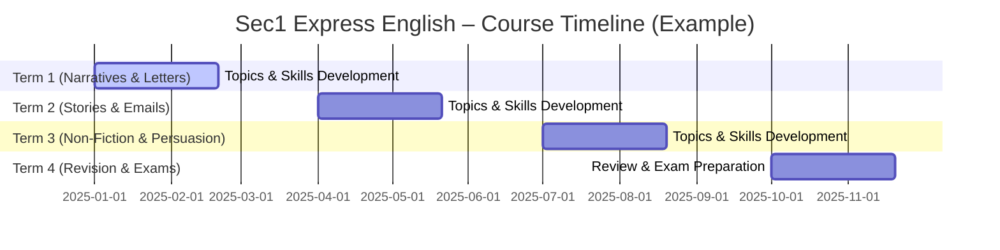

# Secondary 1 Express English (Singapore – Express Stream)

**Executive Summary:** Singapore’s Secondary 1 (Sec 1) English Express course (4-year programme leading to O-Levels) builds on primary-school English to deepen students’ language skills across reading, writing, oral, listening and grammar/vocabulary. The curriculum (English Syllabus 2020, Express/NA) emphasises **effective and affective communication**: learners “listen to, read and view critically” and “speak, write and represent in standard English” for varied purposes【54†L173-L181】. It aims to cultivate **Discerning Readers, Empathetic Communicators and Creative Inquirers**【58†L138-L147】. Teaching typically spans four terms each year, with Term 1–2 focusing on narrative and personal texts (stories, letters), Term 3 on informational/persuasive texts, and Term 4 on revision/exams (schools customise pacing【50†L27-L34】【50†L57-L65】). Assessment is wholly school-based in lower sec: a mix of written tests, portfolios, orals and projects (no national exam until upper sec). Recommended resources include MOE-approved textbooks (see table below) and multimedia tools. Differentiation and home support help all learners engage: e.g. extension projects for higher-ability, scaffolds and reading support for lower-ability. Recent MOE policy shifts (e.g. Full Subject-Based Banding from 2024【109†L128-L133】, removal of multiple-choice in exams) reflect a move to skill-based learning. The following report details the course aims, syllabus content by skill and term, assessments, teaching strategies and resources, and alignment with PSLE/secondary progression.

## Course Aims and Learning Outcomes

- **Overall Aim (EL Syllabus 2020):** Develop **effective and affective language use**【54†L173-L181】. Students should listen, read and view a wide array of texts with understanding and appreciation, and **speak, write and represent** in grammatical, fluent, appropriate English for various purposes, audiences and contexts【54†L173-L181】【58†L138-L147】. They must also **use grammar and vocabulary accurately** to communicate meaning and achieve impact【54†L173-L181】【58†L138-L147】. 
- **21st-Century Outcomes:** The curriculum seeks to produce learners who are *(i)* **Discerning Readers** (read/listen/view critically for understanding)【58†L138-L147】, *(ii)* **Empathetic Communicators** (speak/write with clarity, appropriacy and empathy)【58†L138-L147】, and *(iii)* **Creative Inquirers** (apply language flexibly and creatively, understanding how language conveys meaning)【58†L138-L147】. 
- **Strand Outcomes:** By Sec 1, students should **read/view closely and widely** (for literal, inferential and critical understanding)【70†L979-L988】【70†L1017-L1025】, **write/represent** coherently for varied audiences (showing organisation, tone and basic writing mechanics)【72†L1256-L1262】, and **communicate orally** in discussions and presentations. They should develop **writing readiness** (legible handwriting, spelling, punctuation) and basic idea-generation and organisation skills【72†L1256-L1262】, while **grammar knowledge** (tenses, sentence structure, basic metalanguage) is taught explicitly to support all skill areas【72†L1256-L1262】【74†L632-L638】.
- **Skill-Specific Aims:**  
  - *Reading & Viewing:* Strengthen close, critical reading of narrative and factual texts. Develop strategies (skimming, inference, summarising) to handle more complex stories and informational passages. Gradually extend to *extensive* reading of diverse multimodal texts for different purposes【70†L979-L988】【70†L1017-L1025】.  
  - *Writing & Representing:* Foster a positive attitude to writing; practice basic writing mechanics (handwriting, spelling accuracy) and organise ideas in paragraphs【72†L1256-L1262】. Produce a variety of personal and creative texts (narratives, recounts, letters, emails) using appropriate tone and structure【72†L1256-L1262】. Later in the course, introduce persuasive/expository forms and multimodal composition.  
  - *Oral & Listening:* Build attentive listening habits and note-taking; practise speaking in class (stories, role-plays, presentations) with clear pronunciation and expression. Participate in discussions to share ideas. (These are woven into reading/writing topics.)  
  - *Grammar & Vocabulary:* Teach grammar explicitly (word, phrase, sentence levels) with correct terminology【74†L632-L638】. Focus on tenses, articles, conjunctions, basic sentence structures early on, so that students can use them for more complex purposes like argument or explanation as they progress【74†L632-L638】. Vocabulary lessons build word power (roots, synonyms, topic words) to improve comprehension and expression.  

## Detailed Syllabus & Term-by-Term Topics

The MOE syllabus (2020) does not mandate a fixed week-by-week plan; schools design their own pacing. A **typical term-wise breakdown** (as illustrated by Yishun Sec School【50†L27-L34】【50†L57-L65】) might be:

| **Term** | **Reading & Viewing**                        | **Writing Genres**                 | **Listening/Speaking**   | **Grammar/Vocab**           |
|----------|----------------------------------------------|-----------------------------------|--------------------------|-----------------------------|
| Term 1   | Structure/features of **narrative texts** (stories) and **informal letters**【50†L27-L34】.            | Writing an *informal letter* and a *short narrative/story*【50†L27-L34】.            | Group discussions (oral narrations, storytelling). | Simple tenses (e.g. **simple past**), **imperatives**; basic cohesive devices【50†L41-L43】. |
| Term 2   | Understanding/analysing a *short story* (literary text)【50†L57-L64】.                                   | Writing an *informal email* and another short story【50†L57-L64】.                  | Story-telling & presentation skills (students retell stories, express feelings)【50†L69-L77】.  | Prepositions, **connectors**, fronting; refining vocabulary for narration and description. |
| Term 3   | **Non-narrative texts** (news articles, reports, expositions): main ideas, features and structure (e.g. headings, facts).                                 | Formal writing: *summary writing*, *description*, or *persuasive writing* on current issues. | Listening comprehension of informational talks; role-play scenarios. | Past continuous, inversion (if advanced); **progressive tense**, clauses of reason (if introduced). |
| Term 4   | **Revision**: revisit earlier genres; practice unseen comprehension passages (both narrative and expository).    | **Exam revision**: timed compositions covering all text types studied.         | Exam practice: listening tasks, oral revision. | Comprehensive review of key grammar points. |

*Table: Example Sec 1 Express syllabus by term (adapted from Yishun Sec’s curriculum outline【50†L27-L34】【50†L57-L65】). Actual school syllabuses may vary.*

Students should cover a wide range of **text types** across reading and writing (fictional stories, poems, factual reports, letters, emails, dialogic scripts). The syllabus emphasizes both meaning (content) and form (structure, style). For example, while reading a short story, students note narrative elements (setting, characters, plot) and theme; while writing, they practice organising ideas chronologically and using an informal tone for letters/emails【50†L27-L34】【50†L69-L77】.

## Weekly/Term Structure (Pacing)

MOE does not prescribe weekly timetables, but schools commonly use a **12–14 week term** model. One possible **weekly breakdown** (example for Term 1) is:
- *Week 1–2:* Introduction to narrative stories (elements, past simple tense). Reading sample story; discussion of themes.
- *Week 3–4:* Reading/writing informal letters. Identify letter format (salutation, body, closure); practise writing a thank-you letter.
- *Week 5:* Listening: story retell (students listen to a recorded narrative and answer questions).
- *Week 6:* Grammar focus: imperatives (commands), time phrases for storytelling.
- *Week 7:* Writing workshop: draft a short story in class; peer review.
- *Week 8:* Oral activity: group storytelling/drama based on a picture or prompt.
- *Week 9:* Class test on Term 1 content (short comprehension, grammar fill-in, short writing task).
- *Week 10:* Revision and enrichment (extra reading, vocabulary games).
- *Weeks 11–12:* Consolidation, remedial lessons or project work (e.g. creating a short comic strip).
- *End-of-term:* End-of-Term exam covering reading and writing (may include unseen passages, composition).

A **Term-long scheme** would align all topics: e.g., Weeks 1–8 cover narrative and letters, Weeks 9–12 wrap up and test (as above). Teachers often build in formative checkpoints (quizzes, drafting sessions) and summative exams.

```mermaid
flowchart LR
  A[Plan Teaching Units] --> B[Deliver Lessons & Activities]
  B --> C[Formative Assessments (quizzes, assignments)]
  C --> D[Teacher Feedback & Remediation]
  D --> E[Summative Assessment (End-of-Term Test)]
  E --> F[Grading & Reporting]
  F --> G[Inform Parents & Reflect]
  G --> A
```
*Flowchart: Typical cycle of teaching and assessment in a Sec 1 English course.*


*Gantt chart: Example of a 4-term timeline for Sec 1 Express English (January–December 2025). Each term focuses on different text genres.* 

## Assessment Methods and Weightings

- **School-Based Assessment (SBA):** All assessments for Sec 1 are designed and administered by the school. Typical components include:
  - *Formative tasks:* In-class quizzes, comprehension exercises, oral presentations, group projects, weekly spelling dictations, etc. For example, tasks like podcasts, reading-aloud, targeted practice (worksheets) assess specific skills【77†L173-L177】.
  - *Continuous Writing:* Essays or creative writing assignments each term (e.g. a narrative story, letter or report).
  - *Oral & Listening Assessments:* e.g. story-telling performance, paired dialogues, listening cloze passages.
  - *Project/Portfolios:* Compilations of written work, reflections or multimedia projects.
- **Summative Assessments:**  
  - *End-of-Term Tests:* Traditional paper-and-pen exams (45–60 min) covering reading comprehension and writing. (Schools often weight Term 2 and Term 4 tests more heavily as major exams.)  
  - *Mid-Year/Prelim Exams:* Some schools hold a mid-year exam (Term 2 or 3) to prepare for end-of-year exams.  
- **Weightings:** MOE guidelines suggest a balanced approach; a common model is ~60–70% written exam and 30–40% course work. For instance, one scheme might allocate 50% to written tests, 25% to compositions, 15% to listening/oral, and 10% to class participation. These vary by school.
- **Assessment Criteria:** Rubrics focus on **Content**, **Organisation/Coherence**, and **Language (vocabulary, grammar, mechanics)**. For example, an upper-band writing sample “shows effective use of ambitious vocabulary and grammar structures” with “complex vocabulary, grammar, punctuation and spelling used accurately”【85†L274-L282】. Lower bands are marked down for missing points, weak structure or limited language. (See sample rubric below.)

```plaintext
Assessment Rubric (Example for Writing Task – Response out of 20):

- Content/Task Fulfilment (10 pts): Addresses required points; develops ideas relevant to purpose/audience. Top band: all points fully addressed and developed【80†L246-L254】.
- Organisation/Coherence (5 pts): Clear structure with logical paragraphs/sequence; uses connectors. Top band: coherent and cohesive presentation across response【85†L274-L282】.
- Language (5 pts): Range and accuracy of vocabulary, grammar, punctuation, spelling. Top band: varied and complex vocabulary/structures used correctly【85†L274-L282】.
```

*Example Rubric Excerpts:*  
- *Top Band (17–20/20):* “Coherent and cohesive presentation; effective use of ambitious vocabulary and grammar; complex structures and punctuation used accurately”【85†L274-L282】.  
- *Lower Bands:* fewer points, simpler language (see Cambridge generic criteria【80†L246-L254】【85†L276-L283】).

## Textbooks and Resources

Schools typically use MOE-approved materials. Recommended print and digital resources include:

| Title & Edition                          | Publisher                 | Description / Notes                                     |
|------------------------------------------|---------------------------|--------------------------------------------------------|
| *Cambridge Lower Secondary English 8* (Student’s Book, 1st ed.) | Cambridge Univ. Press      | Covers literacy skills for Secondary 1 (Cambridge curriculum). Supports 21CC; includes both fiction and non-fiction texts. Endorsed by Cambridge International【85†L274-L282】. |
| *Complete English for Cambridge Lower Secondary: Stage 8* (Student Book, 2nd ed., 2021) | OUP (Oxford Univ. Press)    | Integrated skills text aligned with Cambridge Lower Sec. Topics include storytelling, poetry, media. Workbooks available. |
| *NIE/Focus Lower Sec English SB* (e.g. by Pearson, latest ed.) | Pearson Education (Pinnacle) | Designed by NIE faculty to match MOE syllabus. Includes thematic units, genre writing practice and grammar exercises. Accompanied by Student Workbook. |
| *Lightning Grammar & Composition 1* (2019 Ed.) | Shing Lee Publishers       | Focused grammar and writing practice for Sec 1. Exercises on tenses, paragraphs, situational writing tasks. |
| *Lower Secondary EL Textbook* (Marshall Cavendish series) | Marshall Cavendish       | Core English textbook used in many schools. Contains reading passages, writing models and question sets by topics. |
| *Oxford Progressive English Course 1* | Oxford Univ. Press (OUP)  | Literature-centric series with stories and poems, guided comprehension, and extension questions. Popular in Secondary. |

*Table: Sample textbooks and series for Sec 1 Express English. Schools select materials from the MOE Approved Textbook List.* (Exact editions/ISBNs vary by year; parents should refer to the school’s booklist.) 

In addition to textbooks, resources include **school Library books**, online media (videos, news articles), the **Singapore Student Learning Space (SLS)** for e-learning tasks, and competitive reading programmes (e.g. HSBC Young Reporters). Exam-oriented practice workbooks (e.g. by Popular or StarPub) may supplement as needed.

## Sample Lesson Plans

**Weekly Lesson Plan (Sample, Term 1):**  
| Day     | Focus                   | Activities                                           | Resources/Assessment                |
|---------|-------------------------|------------------------------------------------------|-------------------------------------|
| Monday  | *Reading*: Narrative elements | Read a short story as class (projected text). Identify setting, characters. | Story text; Worksheets on story elements. |
| Tuesday | *Grammar*: Simple Past / Imperatives | Explain simple past tense rules; practice converting present→past. Imperative sentences. | Grammar worksheet; whiteboard drills. |
| Wednesday | *Writing*: Narrative Writing (Draft) | Students write opening paragraph of a story (first-person). Teacher reviews writing plan (story map). | Writing frames; teacher conference. |
| Thursday | *Listening/Speaking*: Story Retell | Play an audio of a story. Students answer listening Qs. In pairs, retell each other’s stories. | Audio recorder; listening questions. |
| Friday  | *Skills Integration*: Group Discussion | In groups, discuss a “What would you do?” scenario (in second person command). Practice using imperatives. | Role-play scenario cards. |

**Term-Long Sample Outline (Term 1):**  
- **Weeks 1–2:** Literary analysis (characters, theme) of a grade-appropriate story.  
- **Week 3:** Grammar introduction (simple past tense, imperatives) and vocabulary building (common verbs).  
- **Week 4:** Guided writing: planning and drafting an informal story.  
- **Week 5:** Peer review and revision of written drafts.  
- **Week 6:** Informal letter-writing (format, tone) with letter model.  
- **Week 7:** Listening comprehension practice using story-based audio; oral reading of student passages.  
- **Week 8:** Mid-term test: short comprehension passage, grammar fill-in, short writing.  
- **Weeks 9–10:** Review errors; introduce more complex story elements (flashbacks, dialogue).  
- **Weeks 11–12:** Final project – students create a mini storybook or comic (combining writing and art).  
- **End Term:** Term examination (comprehension + narrative writing).  

(Teachers adjust pace based on class needs. Lesson plans emphasise active learning and varied formats.)

## Sample Assessment Tasks and Rubrics

1. **Continuous Writing Task:** “Write a story about an adventurous journey.”  
   - *Rubric:* Content (40%): covers all story elements (setting, character, plot). Coherence (30%): clear sequence and paragraphing. Language (30%): vocabulary range, grammar accuracy, spelling.  
   - *Criteria Highlights:* Top work “addresses all narrative points in detail”【80†L246-L254】, uses varied vocabulary/complex sentences correctly【85†L274-L282】. Lower work may lack development or contain many errors.  

2. **Situational Writing:** “Your friend will be moving away. Write an informal letter giving advice.”  
   - *Rubric:* Task fulfilment (purpose, tone, format)【80†L246-L254】, ideas supported (relevant advice), language accuracy and register.  

3. **Comprehension Exercise:** Given a poem or short passage, answer literal and inferential questions.  
   - *Mark Scheme:* Marks for correct content reference, explanation of meaning, use of evidence, clarity. Misconceptions or unsupported answers score lower.  

4. **Oral Presentation:** “Describe the setting of your favorite book to the class.”  
   - *Rubric:* Fluency, pronunciation, vocabulary (e.g. use of adjectives), eye contact.  

*Rubrics should reflect syllabus criteria:*  
- **Task Fulfilment:** All required points addressed; awareness of audience/purpose【80†L246-L254】.  
- **Organisation:** Logical sequencing, paragraphing, use of connectors.  
- **Expression:** Range and correctness of vocabulary/grammar (top band: “ambitious vocabulary and complex structures used accurately”【85†L274-L282】).  

## Differentiation (High- and Low-Ability Learners)

- **High-Ability Students:** Provide extension tasks and more challenging texts. For example, assign them independent reading of a novel excerpt; encourage them to write an extra short story or enter a writing competition. Use higher-order tasks (analysis of word choice in literature, peer-teaching roles). Allow creative projects (making podcasts, role-plays, multimedia presentations).  
- **Low-Ability Students:** Use **scaffolding** and multi-sensory aids. Provide graphic organisers for writing (e.g. story maps), sentence starters, word banks, and concrete visuals. Break lessons into smaller steps and check understanding frequently. Use paired reading or guided small groups for support. Simplify tasks where needed (e.g. shorter writing prompts, model answers). Focus on mastery of core content before extending.  

Teachers should also differentiate by task format (oral vs written), pacing (extra practice for slower learners), and support (peer buddies, coaching). Regular formative assessment helps identify students needing intervention or enrichment.

## Parental Guidance and Home Practice

Parents can support Sec 1 English by:  
- **Encouraging Regular Reading:** Provide access to engaging books, newspapers or online articles. Discuss reading together to build comprehension and critical thinking.  
- **Practising Writing:** Ask your child to write daily (e.g. diary, email, story) and give constructive feedback. Review school assignments, checking for grammar and spelling.  
- **Oral Language at Home:** Have conversations about daily events or current news, prompting your child to explain or argue a point (practising spoken English and vocabulary).  
- **Homework Monitoring:** Ensure English homework is done on time. Use online resources (e.g. SLS English modules) for extra practice, and educational apps for vocabulary and grammar drills.  
- **Positive Reinforcement:** Praise effort in language skills. Reward improvement in reading or writing, and encourage curiosity in words and language.  

According to MOE, strong home-school partnerships boost students’ confidence and discipline【87†L5-L8】. Involvement can be as simple as quizzing your child on vocabulary or reading their compositions and celebrating progress.

## Alignment with PSLE and Secondary Progression

Sec 1 English builds directly on Primary 6 (PSLE) English. PSLE focuses on reading comprehension (of fiction and factual passages), situational writing (formal letter, article, report), grammar/vocab, and oral (speaking/listening). Secondary Express continues these strands with greater depth:
- **Similarities:** Continued emphasis on clarity, grammar accuracy and meeting purpose/audience. Both PSLE and Sec 1 ask for coherent writing and evidence of reading comprehension.  
- **Differences:** Secondary-level texts and topics are more complex; questions require deeper inference and critical response. Writing tasks expand beyond personal recounts to include opinion, exposition and argument. As one guide notes, “Secondary English… requires a higher level of critical thinking and analysis” compared to primary【65†L1294-L1302】. Students tackle novels, poetry and varied media at Sec 1.  
- **Progression:** Skills are progressively developed – e.g., a Primary student who wrote a basic descriptive essay will in Sec 1 learn persuasive techniques and begin to experiment with style and creative voice. Grammar instruction shifts from mastering parts of speech to understanding how language choices (modality, voice) shape tone and impact.  

In summary, Sec 1 acts as a bridge: consolidating PSLE foundations while pushing towards the demands of upper secondary and eventual O-Level English. (Foundational skills from PSLE, such as critical reading of texts and clear composition, remain essential and are explicitly built upon in the new syllabus.)

## Recent MOE Updates/Policy Notes

- **Curriculum Reform (Full SBB):** As of 2024, MOE has phased out express and normal streams. Under Full Subject-Based Banding【109†L128-L133】, students are placed in broad bands with flexibility to take English at higher or foundation level as they progress. The **Express English syllabus (2020)** for the final cohorts remains in use for Sec 1–4 of 2023 and early 2024 cohorts. 
- **Revised Syllabus Emphases:** The 2020 syllabus underscores 21st-century skills. There is less emphasis on discrete testing (no multiple-choice/cloze) and more on **creative/critical tasks** and learner-centred pedagogy【65†L1179-L1184】. For example, grammar editing (error-spotting) and discussion tasks have been introduced in later sec exams. Schools also incorporate formative assessment data for personalized learning.  
- **Assessment Changes:** MOE has removed traditional MCQs from Sec 1–2 English assessments to focus on open-ended responses【65†L1179-L1184】. Listening tasks and oral mark have been strengthened in weight. Continual review and adjustments (via termly circulars) keep the assessment aligned with the syllabus goals.  
- **Support Programmes:** MOE provides support for teachers (e.g. the English Language Institute’s resources, national exams frameworks) and encourages use of technology (e.g. English Language Learning Portal).  

Schools and teachers stay updated via MOE circulars (e.g. Secondary Sec 1 Assessment Handbook) and use MOE’s curriculum website and Teacher’s Network for guidance. The key policy trend is towards holistic, student-centred English education, and preparing students for a bilingual, technologically-rich world.

